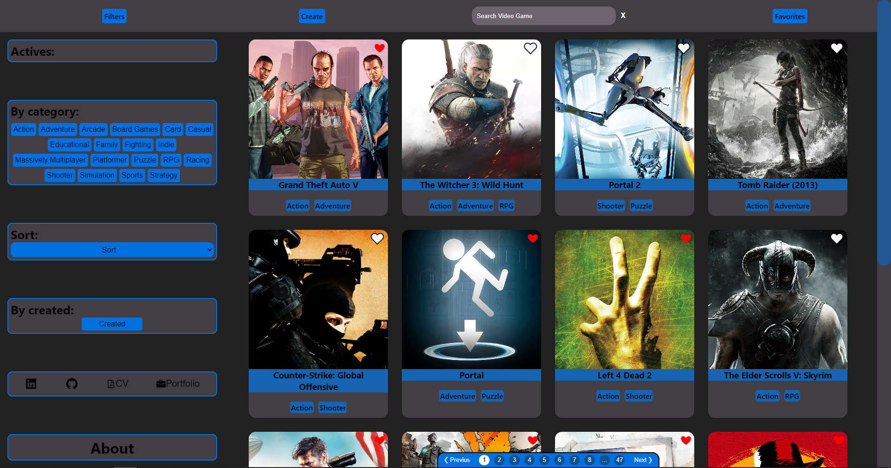
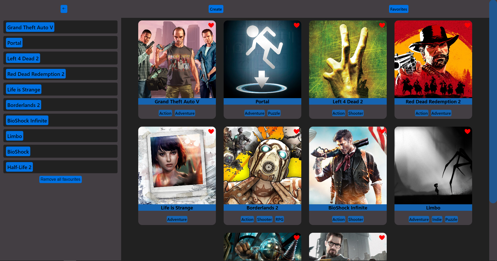
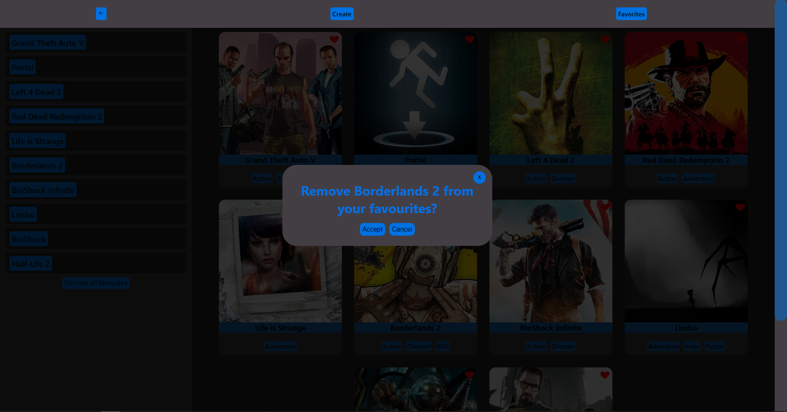
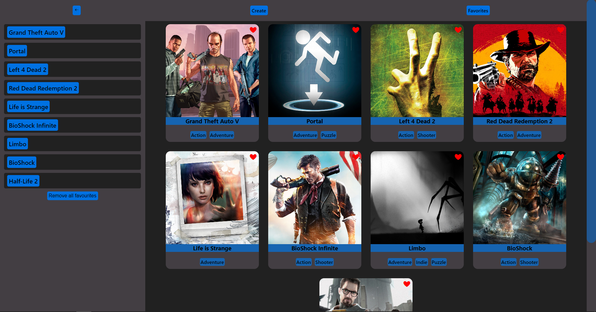
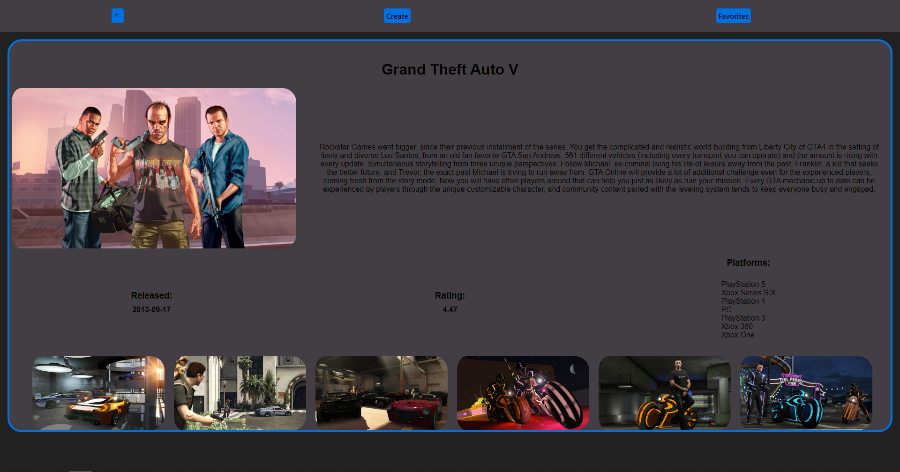
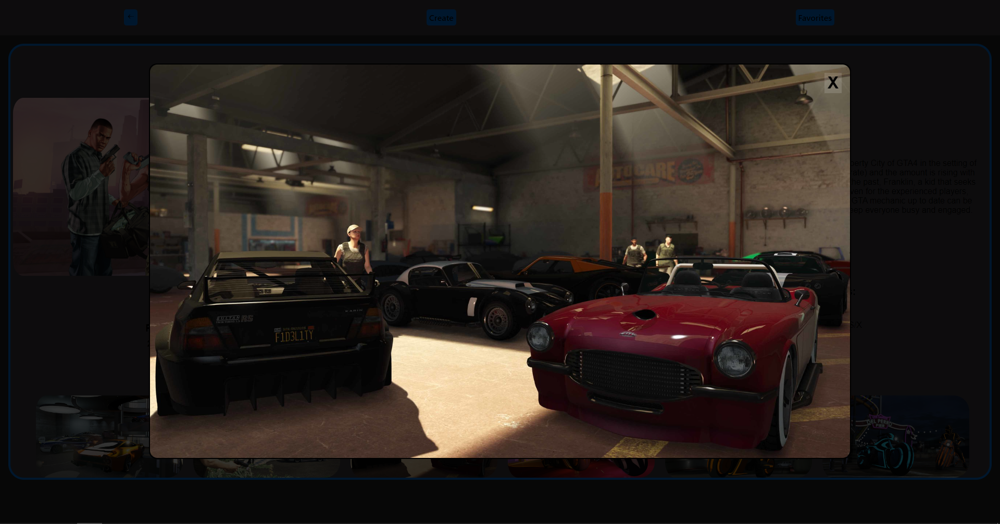
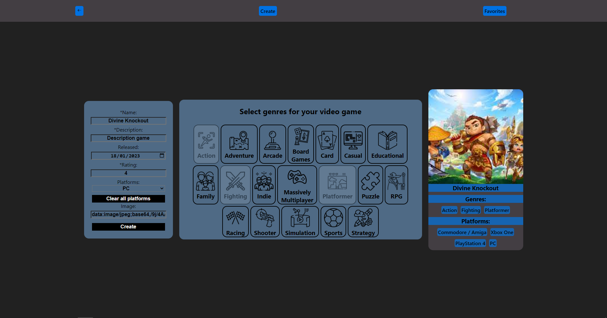
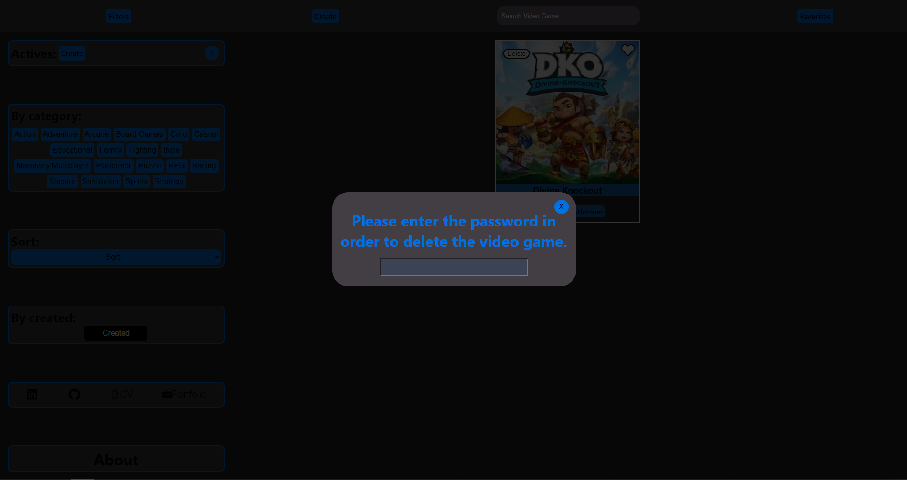

# 
😃 Hola, espero que te encuentres bien! 👋 

Mi nombre es Fermín Solaberrieta, soy Full Stack Web Developer(y un apasionado por la programación).
Me gusta mejorar mis conocimientos aprendiendo día a día, ya sea de forma independiente o en grupo.

  

## 
 👨‍💻 Algunas de mis habilidades: 

 

  
  
  
  
  

  
  
  
  
  
  

  🔹JavaScript
  🔸Express.js
  🔸NodeJS
  🔹React.js
  🔸Redux

  🔸Sequelize
  🔹PostgreSQL
  🔸TypeScript
  🔹Git
  🔹HTML5
  🔸CSS

  

## 
 🗂 Mis Proyectos 

 

### 
<a href='https://game-informer.vercel.app/'> 💡 Game Informer </a> 

<pre>🎮Game Informer es una SPA en la que podrás ver TODOS los juegos que quieras con: 🔸Información específica de cada video juego(imágenes, fecha de lanzamiento, plataformas, etc.)
🔸En su home se encuentra un apartado de búsqueda, filtros y ordenamientos combinados.
🔸Podrás crear nuevos juegos mediante un formulario totalmente controlado y persistente.
🔸Eliminar el video juego creado.
🔸Navegar por toda la página mediante la navbar y/o paginación.
🔸Guardar sus juegos favoritos.
🔸Apartado about donde se especifica la página al detalle.
</pre>

  
  
  
  
  
  
  
  
  

### 
 🛠 Tecnologías y herramientas usadas: 

  

   
   
  
  
  
    
    
  
  
  
  
  
  
 

       🔹JavaScript
       🔹React.js
       🔹Node.js
       🔹Redux 
       🔹Express 
       🔹CSS
       🔹HTML
       🔹PostgreSQL
       🔹Sequelize
  
 
 

  

 

## Github Stats:

<table>
  <tr>
    <td valign="top"></td>
    <td valign="top"></td>
  </tr>
</table>

  
  

 

## Contacto 🤝

 <a href='https://www.linkedin.com/in/fermin-solaberrieta/'>  LinkedIn </a> 

 📫 fermin234@hotmail.com 

 📱  +54 2473-400240 

